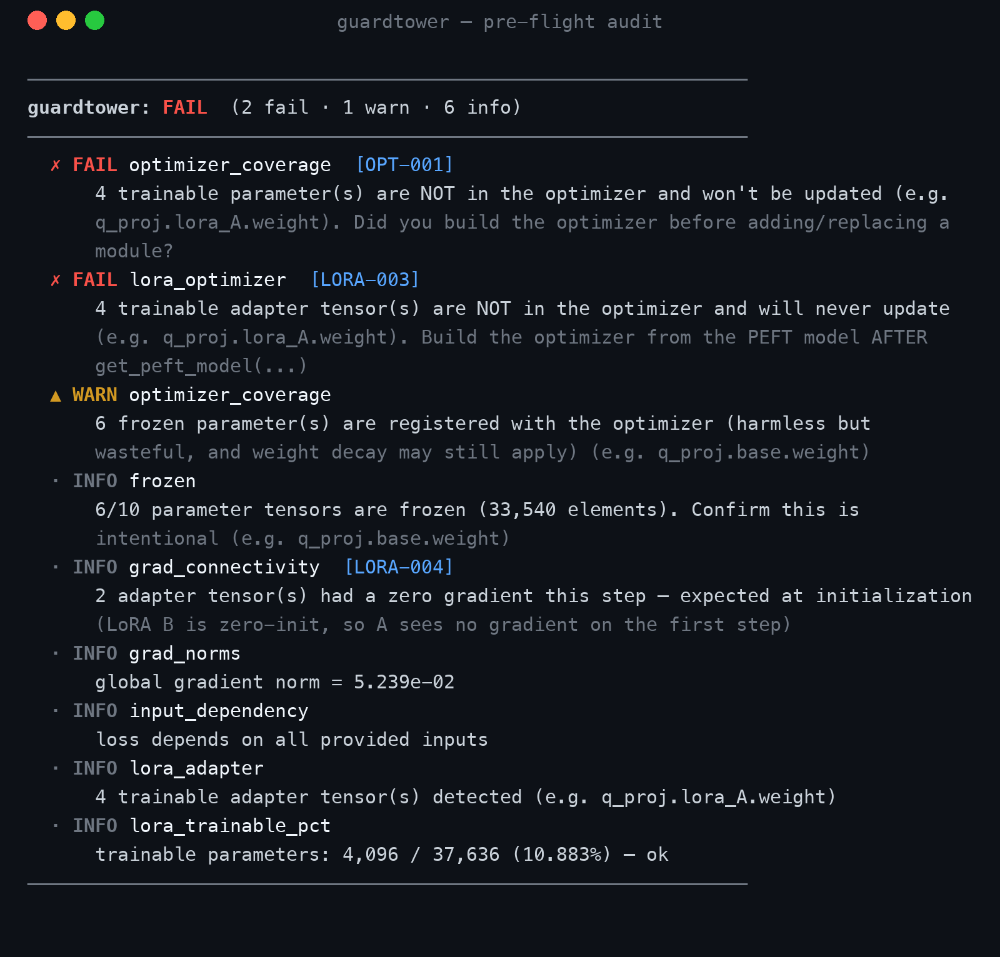

# guardtower

**Catch the silent fine-tuning bugs that waste GPU-hours, before you launch the run.**

Most training bugs don't crash. The model runs, the loss goes down, and hours
later your results are quietly wrong because the part you *meant* to train never
did. `guardtower` runs **one instrumented training step on a single batch** and
tells you, in plain language, exactly what's broken, then points each finding at
a documented [catalog of failure modes](CATALOG.md) with the fix and a reference.

It's a pre-flight check for PyTorch training: a few seconds and no GPU to rule
out the expensive, invisible mistakes.

## What it does

- **Instruments one real step** — forward, backward, and optimizer wiring — and
  reports what would silently go wrong over the next six hours.
- **Knows how people fine-tune today.** Auto-detects **LoRA / PEFT / QLoRA** and
  **multi-GPU (DDP / FSDP)** and runs the right checks, no config.
- **Doesn't cry wolf.** It understands, for example, that LoRA's zero-initialized
  `B` matrix makes `A` show a zero gradient on step 1, so it reports that as
  *expected* instead of a false alarm.
- **Maps every finding to a catalog entry** (`what it is · why it's silent · how
  to fix · reference`), so a result is also an explanation.
- **Fails fast.** One call aborts a misconfigured run before training starts
  in a script, in CI, or as a Hugging Face `Trainer` callback.
- **Pure inspection.** Core checks need only PyTorch; PEFT/transformers are
  never imported for LoRA detection, so it's safe on any model.

### What it catches

| Area | Examples |
|------|----------|
| **LoRA / PEFT** | base model left unfrozen, adapter frozen so nothing trains, adapter missing from the optimizer, trainable-% sanity, QLoRA dtype mismatch |
| **Distributed (DDP / FSDP)** | an unused parameter that will *hang* DDP, plain BatchNorm that should be SyncBatchNorm, an initialized process group with an unwrapped model |
| **Core wiring** | a parameter that gets no gradient, a trainable param missing from the optimizer, a loss detached from the graph, a loss that doesn't depend on the input |
| **Numerics** | NaN/Inf in forward **and** backward pinpointed to the module, dead ReLUs, exploding / vanishing gradient norms |

The full, referenced list lives in **[CATALOG.md](CATALOG.md)** — 21 modes and counting.

## See it catch a real bug

A textbook silent LoRA mistake: the optimizer is built from the model, and the
adapter is added *afterwards*. The optimizer captured the base weights (now
frozen) and never sees the adapter tensors, the only thing meant to train.
Nothing crashes; the loss even drifts a little. Six GPU-hours later the adapter
is exactly where it started.

guardtower flags it on the first step, from two angles, while correctly
treating the zero-init adapter gradient as expected, not a bug:



Reproduce it yourself: [`examples/lora_optimizer_bug.py`](examples/lora_optimizer_bug.py).

## Install

```bash
pip install guardtower            # core (PyTorch only)
pip install guardtower[hf]        # + Hugging Face Trainer integration
```

## Use it

### Drop it into the Hugging Face `Trainer` you already run

One line audits the model on the first real batch and can abort before the
expensive part starts:

```python
from guardtower.integrations.huggingface import GuardtowerCallback

trainer = Trainer(
    model=model,
    args=training_args,
    train_dataset=ds,
    callbacks=[GuardtowerCallback(raise_on_error=True)],
)
trainer.train()
```

If the adapter isn't wired up, the run stops immediately instead of training
nothing for six hours:

```
[guardtower] pre-flight audit on first batch:
────────────────────────────────────────────────────────────────
guardtower: FAIL  (1 fail · 0 warn · 2 info)
────────────────────────────────────────────────────────────────
  ✗ FAIL lora_optimizer  [LORA-003]
      4 trainable adapter tensor(s) are NOT in the optimizer and will
      never update. Build the optimizer from the PEFT model AFTER
      get_peft_model(...)
────────────────────────────────────────────────────────────────
```

### Or call it directly

```python
import guardtower

# Quick, training-free LoRA check:
print(guardtower.lora_summary(model, optimizer=optimizer))

# Full pre-flight (runs one step):
report = guardtower.audit(
    model,
    lambda: loss_fn(model(x), y),   # closure returning a scalar loss
    optimizer=optimizer,
    inputs=x,
)
report.raise_if_errors()            # fail fast in CI / before launching
```

### Keep a cheap NaN watch on a real run

Leave a guardtower on for the first steps so a blow-up is pinpointed to the exact
module the instant it happens, instead of surfacing as a useless `loss=nan`
several layers downstream:

```python
with guardtower.monitor(model, on_nonfinite="raise"):
    for batch in loader:
        train_step(batch)
```

## The `Report` object

| attribute / method                 | meaning                                          |
|------------------------------------|--------------------------------------------------|
| `report.ok`                        | `True` if there are no blocking (FAIL) findings  |
| `report.errors / warnings / infos` | findings by severity                             |
| `report.by_check(name)`            | findings from a specific check                   |
| `report.raise_if_errors()`         | raise `GuardtowerError` on any FAIL (chains)     |
| `report.to_dict()`                 | JSON-friendly dump for logging                   |

Each finding carries a `catalog_id` linking to its [catalog](CATALOG.md) entry.

## The catalog

Hit a new fail? Add an entry to `guardtower/catalog.py` and a check that emits its
id. `guardtower.catalog()` returns the list; `guardtower.catalog_markdown()`
regenerates [CATALOG.md](CATALOG.md).

## Test

```bash
pytest -q                         # 22 tests, no GPU needed
# or, without pytest installed:
python tests/test_checks.py
```

## License

Apache-2.0. See [LICENSE](LICENSE).
